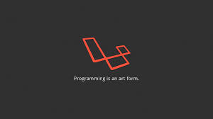
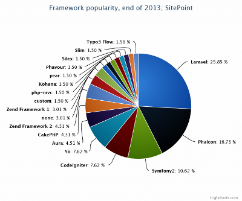

#   Laravel

.fx: first

Mesut Çittir `<mesut.cittir@bil.omu.edu.tr>`

http://mctr.github.io

Nisan 2014

---
# Framework Olarak Laravel

- Laravel, PHP Frameworkü

- Taylor Otwell tarafından tasarlanmıştır

- MVC(Model-View-Controller)

- 2013 yılının en çok tercih edilen PHP Frameworkü

 
 
---
# Gereksinimler

- Bagımlılıkları Yönetmek için `Composer`

- PHP >= 5.3.7

- MCrypt PHP Eklentisi

---
# Laravel Yükleme

## Laravel Installer İle

- [laravel.phar](http://laravel.com/laravel.phar) indirin

- İsmini Laravel olarak degiştirelim(Kolay kullanım açısından)

- `usr/local/bin` dizinine taşıyın

- Artık `Laravel new` komutu ile laravel projeleri oluşturabilirsiniz

- Composer ile kurulum yapmaktandan daha hızlıdır

## Composer Create Project İle

- `composer create-project laravel/laravel Proje_ismi --prefer-dist`

---
# Laravel Yükleme

## Elle İndirerek

- Composeri yükledikten sonra

- [Buradan](https://github.com/laravel/laravel/archive/master.zip) laravelin son sürümünü indirin

- İndirilen .zip dosyasını bir dizine açınız

- Daha sonra uygulamanın ana dizininde `composer install` veya `php composer.phar install` komutunu çalıştırın

- Bu işlemin yapılabilmesi için sisteminizde `Git` yüklü olması gerekir
 
---
# Başlangıç Ayarları

- Öncelikle projemizin sorunsuz çalışması için app/storage dizininin dosya izinlerini degiştirmeliyiz

- `chmod -R 755` komutu ile izinleri ayarlamış olduk

- Artık laravel projemizin default olarak gelen hello sayfasına ulaşabiliriz

- Tarayıcımızı açıp `localhost/proje_ismi/public/` adresine gittigimizde laravel sayfası gelecektir

- Yukarıdakini yaptıgınız halde sayfa yüklenmiyorsa birde bunu deneyin `localhost/proje_ismi/public/index.php`

- Eger bu şekilde sayfa yüklenirse apache ayar dosyanızdan `mod_rewrite` özelligini aktif edip ilk verdigim link `i de kullanabilirsiniz

---

